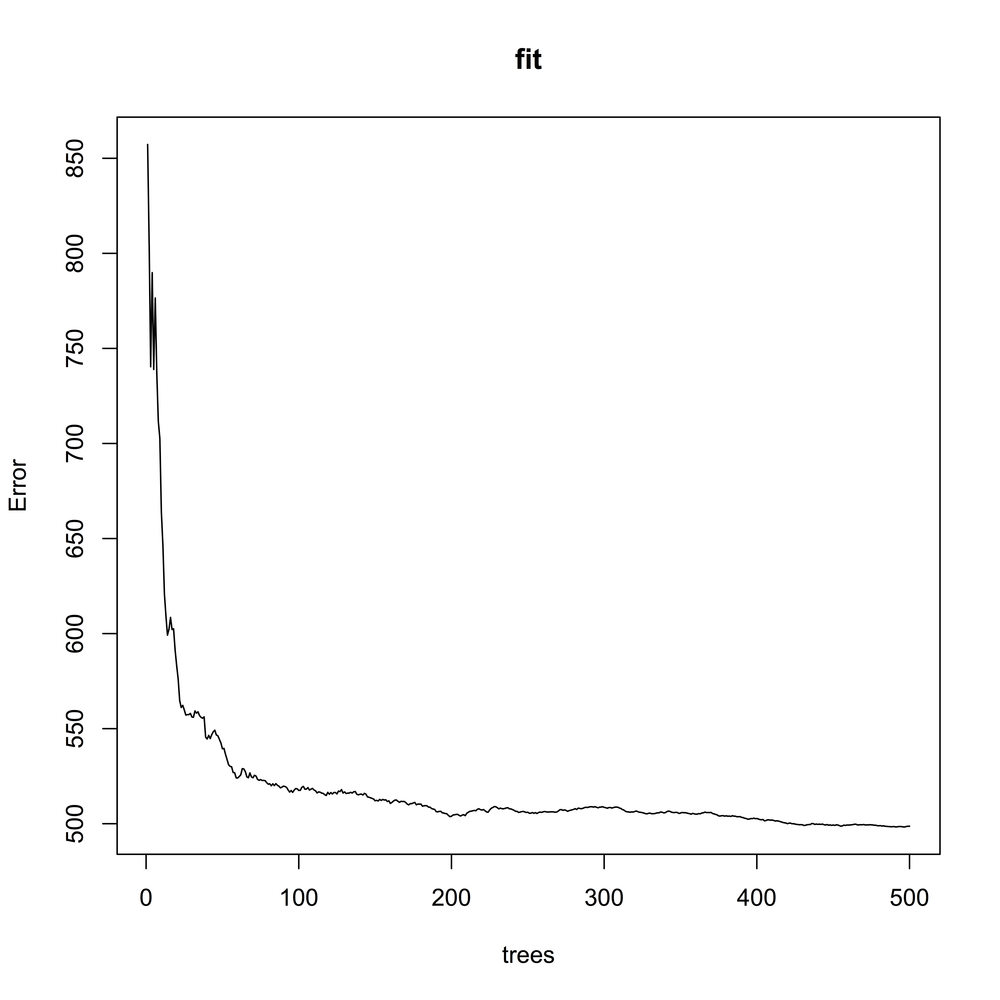
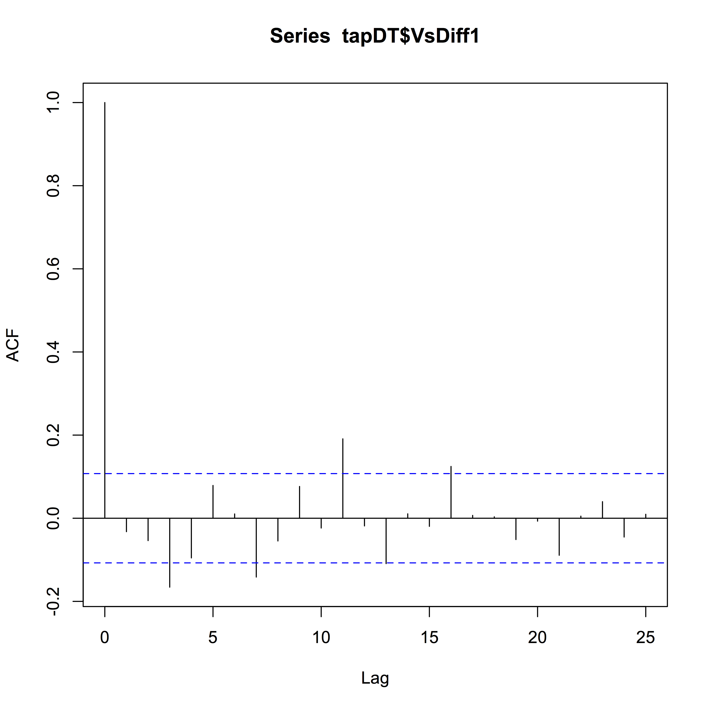

Scripts for time-series analysis and regression in order to develop explanations of the relationships that are controlling hydraulic redistribution by mesquites (prosopis velutina woot.) in the Santa Rita Experimental Range, Arizona.
PROJECT IN DEVELOPMENT
 and lateral roots (red)")
^Lateral roots drawn in red and tap roots in blue.  Negative velocity in the tap (blue) indicates hydraulic descent and positive velocity indicates hydraulic lift.

")

Some interesting indications of both autocorellation and multimodality:

Which we also clearly see in the residuals:

Autocorrelation, though statistically significant, does not appear to be strong after differencing, 

Especially when compared to cross correlation:
 changes in Tap Velocity.png "Changes in the Delta Soil Moisture actually FOLLOW (lag) changes in Tap Velocity")

Exploratory work with ARIMA Forecasting (NEEDS TO BE UPDATED IN LIGHT OF NEW INFORMATION FROM CCF() AS SHOWN ABOVE):
First make the data stationary, using diff() in R:
(diff returns Value:
If x is a vector of length n and differences = 1, then the computed result is equal to the successive differences x[(1+lag):n] - x[1:(n-lag)].)

And test forecast:

